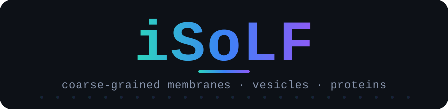

<div align="center">



**Coarse-grained starting structures for [GENESIS](https://mdgenesis.org/) molecular dynamics: lipid membranes and vesicles.**

[](https://github.com/bondrewd/isolf/releases)
[](https://github.com/bondrewd/isolf/actions)
[](https://github.com/bondrewd/isolf/releases)
[](#-license)

</div>

You give `isolf` a lipid recipe, and it writes the coordinates. With `--top` or `--inp` it also writes the topology and force-field files GENESIS reads. Lipids use the iSoLF implicit-solvent model, so there's no water to add. It's a single binary, with nothing else to install.

<p align="center"></p>

## 🗺️ Map

[Install](#-install) · [Quick start](#-quick-start) · [Build modes](#-build-modes) · [Examples](EXAMPLES.md) · [Output](#-output) · [Run in GENESIS](#-run-in-genesis) · [License](#-license)

## 📦 Install

**macOS / Linux**

```bash
curl -LsSf https://raw.githubusercontent.com/bondrewd/isolf/main/install.sh | sh
```

**Windows (PowerShell)**

```powershell
powershell -ExecutionPolicy ByPass -c "irm https://raw.githubusercontent.com/bondrewd/isolf/main/install.ps1 | iex"
```

The installer picks the right binary for your machine, checks its sha256, drops it in `~/.local/bin`, and puts that on your PATH. Update in place with `isolf update`. Remove it with `isolf uninstall`.

<details>
<summary>Other ways to install</summary>

```bash
# with wget instead of curl
wget -qO- https://raw.githubusercontent.com/bondrewd/isolf/main/install.sh | sh

# pin a version, or change the install directory
curl -LsSf https://raw.githubusercontent.com/bondrewd/isolf/main/install.sh | sh -s -- 0.1.0
curl -LsSf https://raw.githubusercontent.com/bondrewd/isolf/main/install.sh | ISOLF_INSTALL_DIR=/usr/local/bin sh

# from source, with a Rust toolchain (https://rustup.rs)
cargo install --path .
```

You can also download a prebuilt binary from the [Releases page](https://github.com/bondrewd/isolf/releases). Pick `windows-msvc.zip`, `apple-darwin.tar.gz`, or one of the `*-linux-musl.tar.gz` files, unzip it, and run `./isolf --version`. On macOS, clear the quarantine flag once with `xattr -dr com.apple.quarantine ./isolf`.

</details>

## 🚀 Quick start

```bash
isolf --upper POPC=1 --lipids-per-leaflet 256 --top --out my_first_membrane
```

This writes `my_first_membrane/` with the structure (`membrane.gro`), the topology (`membrane.top`), and the lipid force field (`isolf.itp`). Add `--inp` for a full GENESIS setup, or `--vmd` for a viewer script.

## 🧱 Build modes

The flags you pass choose one of 2 modes:

| Mode | Example |
| --- | --- |
| **Membrane** | `isolf --upper POPC=1 --lipids-per-leaflet 256 --out m` |
| **Vesicle** | `isolf --upper POPC=1 --vesicle 20 --out v` |

Lipids are `NAME=WEIGHT` recipes like `"POPC=3,POPS=1"` (repeat `--upper`/`--lower` or comma-separate to combine). A name has 4 letters, `<tails><head>`, and there are 35 in all. Set a different bottom leaflet with `--lower`. Size a membrane by lipid count or `--membrane` (e.g. `x=10,y=20`); size a vesicle by `--vesicle` (`ro=20`, `ri=15`, or both).

While it runs, `isolf` prints each phase and a closing summary: the composition, the box, the particle count, the time, and the command to run next. Use `-q` for the summary alone, `-v` for every file path, `--ascii` for plain glyphs.

> 🧪 More recipes are in **[EXAMPLES.md](EXAMPLES.md)**: asymmetric leaflets, rectangular and box-sized membranes, vesicles, and the output formats.

## 📦 Output

Everything lands in the `--out` folder. The `.gro` structure and a `.log` run log are always written. The rest are opt-in:

| Flag | Adds |
| --- | --- |
| `--top` | the topology (`.top`) and the force-field include (`isolf.itp`) |
| `--inp` | GENESIS control files for a 3-step run (implies `--top`) |
| `--vmd` | a VMD script (and the `.psf` it loads) to view the structure |
| `--gif` | a GIF animating the leaflet relaxation |
| `--pdb` `--psf` `--crd` `--cif` | extra coordinate and structure formats |

The full file table and the reproducible run log are in [EXAMPLES.md → Output files](EXAMPLES.md#output-files).

## 🔬 Run in GENESIS

Run the control files in order. Each one continues from the previous step's restart:

```bash
atdyn min.inp     # 1. minimization
atdyn npt.inp     # 2. equilibration  (nvt.inp for a vesicle)
atdyn pro.inp     # 3. production
```

Every option, grouped by topic with its default, is in `isolf --help`.

## 🙏 Acknowledgements

Thanks to Hideto Tsubouchi for testing the code.

## 📄 License

Licensed under either of [Apache-2.0](LICENSE-APACHE) or [MIT](LICENSE-MIT), at your option. Any contribution you submit is dual licensed as above, unless you say otherwise.

---

> Disclosure: This codebase was built with the help of a coding AI from my Python and Julia scripts, and is currently maintained by humans 🧑‍🔬 and ai 🤖.
